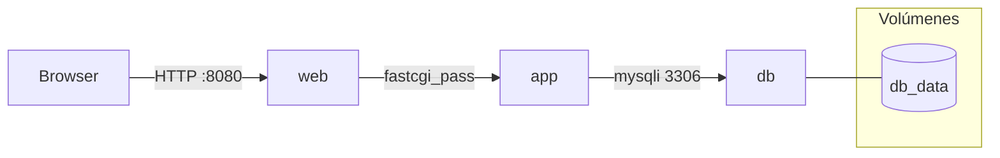

# Creación de Cursos – Dockerización y Guía

Este repositorio contiene una aplicación PHP (procedimental) que sirve páginas con Nginx y PHP-FPM y usa MariaDB como base de datos. Se han añadido Dockerfiles, Docker Compose y scripts de conveniencia para entornos de desarrollo y producción.

## Auditoría rápida

- Lenguaje: PHP (procedural), librería incluida `html2pdf`/TCPDF.
- Runtime: PHP-FPM 8.1 (ajustable), Nginx para estáticos y proxy FastCGI.
- Gestor paquetes: no hay `composer.json` (no se usa Composer).
- DB: MariaDB 10.6 (MySQL compatible). Dump: `u170679010_fpptu.sql`.
- Variables de entorno esperadas: `DB_HOST`, `DB_PORT`, `DB_NAME`, `DB_USER`, `DB_PASSWORD`, `DB_ROOT_PASSWORD`, `PHP_TZ`, `APP_PORT`.
- Puertos: expuesto `APP_PORT` (por defecto 8080) en el host.
- Scripts build/run/test: gestionados vía Docker Compose y `make.ps1`/Makefile.
- Entradas HTTP: raíz `/` y otros PHP; health: `/health` (Nginx).

Riesgos y antipatrones detectados:

- Secretos en el repo: credenciales estaban hardcodeadas en `clases/conexion.php`. Se reemplazó para leer de variables de entorno. Revisa que no queden más secretos.
- Compatibilidad PHP: librerías antiguas (`html2pdf`/TCPDF 5.x). Si aparecen errores con PHP 8.1, bajar a PHP 7.4 (`php:7.4-fpm-alpine`) en `docker/php/Dockerfile`.
- `phpinfo.php`: archivo sensible incluido; no exponer en producción.
- Migraciones: no hay sistema; solo dump SQL. Se automatiza carga inicial con `docker-entrypoint-initdb.d`.
- Archivos grandes: muchas fuentes/recursos en `html2pdf/_tcpdf_5.0.002/fonts` incrementan tamaño de imagen.

## Estrategia de contenedores

- Servicios: `web` (Nginx), `app` (PHP-FPM), `db` (MariaDB).
- Modo desarrollo: bind mount del código para hot-reload (sin reiniciar contenedor).
- Modo producción: imágenes inmutables sin montar código; sin devDeps; usuario no-root en `app`.
- Redes: Compose por defecto (bridge). `web` -> `app:9000`; `app` -> `db:3306`.
- Persistencia: volumen `db_data` para datos de MariaDB. El dump `u170679010_fpptu.sql` se aplica una sola vez en el primer arranque del volumen.
- Límites de recursos: añadir `deploy.resources` si se usa Swarm; opcional en dev.

## Requisitos previos

- Docker Engine 24+ y Docker Compose v2.20+
- Windows: puedes usar `PowerShell` con `.\\make.ps1`. Si prefieres Makefile, instala `make` (Git Bash/Chocolatey) o usa WSL.

## Configuración de entorno

1. Copia `.env.example` a `.env` y ajusta valores.

Variables:

```
APP_PORT=8080
PHP_TZ=UTC
DB_HOST=db
DB_PORT=3306
DB_NAME=fpptu
DB_USER=fpptu
DB_PASSWORD=fpptu_password
DB_ROOT_PASSWORD=change_this_root_password
DB_ADMIN_PORT=8082
```

## Puesta en marcha

Desarrollo (hot-reload):

- PowerShell: `./make.ps1 up`
- Makefile (Linux/WSL/Git Bash): `make up`

Producción (imágenes inmutables):

- PowerShell: `./make.ps1 prod-build` y `./make.ps1 prod-up`
- Makefile: `make prod-build` y `make prod-up`

La app responde en `http://localhost:APP_PORT` (por defecto `http://localhost:8080`). Healthcheck: `http://localhost:8080/health`.

## Migraciones/seed

- Carga inicial: `u170679010_fpptu.sql` se importa automáticamente al iniciar el contenedor de DB por primera vez (solo si el volumen `db_data` está vacío).
- Migraciones posteriores: no hay herramienta integrada. Puedes crear archivos SQL adicionales y montarlos en `docker-entrypoint-initdb.d` o ejecutar manualmente con `db-shell`.

Comandos útiles:

- `./make.ps1 db-shell` abre consola de MariaDB.
- `./make.ps1 migrate` recordatorio de auto-carga inicial.

## Scripts de conveniencia

PowerShell (`make.ps1`) o Makefile con objetivos equivalentes:

- build/up/down/restart/logs/ps
- shell (app), web-shell, db-shell
- migrate, seed, smoke (hace curl a `/health`)
- prod-build, prod-up, prod-down

Ejemplos:

```
./make.ps1 up
./make.ps1 logs
./make.ps1 smoke
```

## Estructura de contenedores

Archivos clave:

- `docker/php/Dockerfile` (targets: `dev`, `prod`)
- `docker/nginx/default.conf`
- `docker/nginx/Dockerfile` (solo prod)
- `docker-compose.yml` (dev)
- `docker-compose.prod.yml` (prod)
- `.dockerignore`, `.env.example`, `make.ps1`, `Makefile`

Diagrama (Mermaid):



## Seguridad y buenas prácticas

- Variables de entorno para credenciales; no commitear `.env`.
- Ejecutar PHP-FPM como usuario no-root (`app`); Nginx sin privilegios elevados dentro del contenedor.
- Healthchecks en `web` y `db`; `depends_on` espera a DB saludable.
- Evitar exponer `phpinfo.php` en producción.
- Revisar compatibilidad si cambias versión de PHP. Si es necesario, usa `php:7.4-fpm-alpine` en `docker/php/Dockerfile`.

## Troubleshooting

- DB no inicia: asegúrate de definir `DB_ROOT_PASSWORD`, `DB_USER`, `DB_PASSWORD` en `.env`.
- Errores de conexión: confirma que `clases/conexion.php` lee variables (ya actualizado) y que `DB_HOST=db` en `.env`.
- Dump no aplicado: borra el volumen `db_data` (`docker volume rm creacion-de-cursos_db_data`) y vuelve a levantar.
- 502/404: revisa logs `./make.ps1 logs` y permisos del bind mount.

## Pagos (PayPal)

- Modos configurables via `.env`:
  - `PAYPAL_MODE=fake`: redirige a `paydone_fake.php` y matricula al usuario sin salir a PayPal (recomendado en dev).
  - `PAYPAL_MODE=sandbox`: usa `https://www.sandbox.paypal.com/cgi-bin/webscr`.
  - `PAYPAL_MODE=live`: usa `https://www.paypal.com/cgi-bin/webscr`.
- Define `PAYPAL_BUSINESS` con el correo de la cuenta receptora (sandbox o live según el modo).
- La URL de retorno se genera automáticamente hacia `paydone.php?faco=<hash>&cod=<curso>`.
